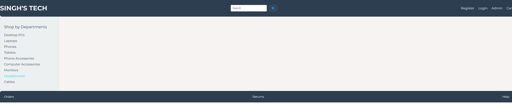
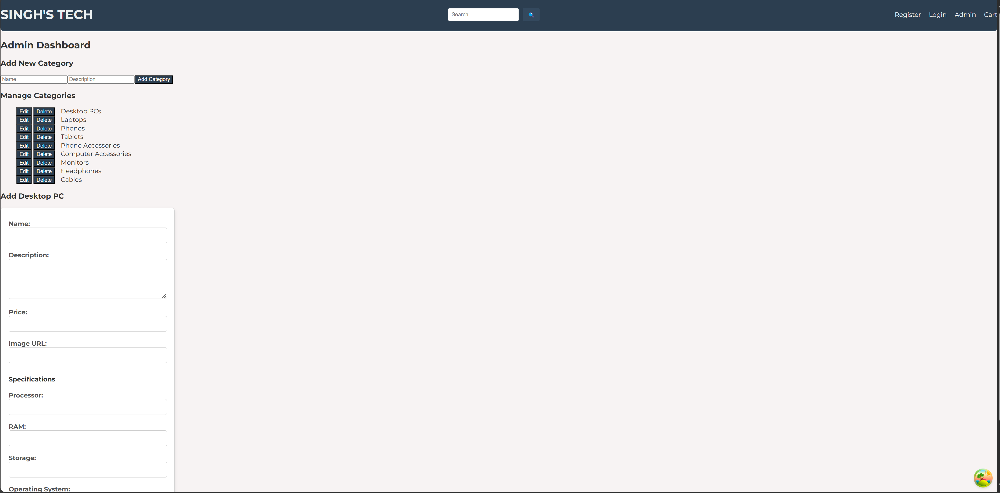

# 🛒 Sings Tech E-Commerce

Sings Tech is a work-in-progress e-commerce website designed for selling tech items such as computers, accessories, mobile devices, monitors, keyboards, headphones, cables, and mice. This is my personal project, and I'm leveraging modern web development tools and best practices to build a functional and visually appealing platform.

---

## 🎯 Goals for the Project

- Implement a **Cart Functionality** to allow users to add, view, and manage products in their cart.
- Secure the platform with **OAuth2 Authentication** to ensure safe user login and account management.
- Build a scalable and user-friendly admin panel for managing categories, products, and orders.

---

## 🛠️ Current Features

### Home Page (in development)
- Clean and responsive layout showcasing product categories and featured products.
- Intuitive design for users to easily browse and explore tech items.

### Admin Page (in development)
- Functionality to manage product categories and add items.
- A simple and accessible interface for administrative tasks.

---

## 🔧 Tech Stack

### Frontend:
- **React**: A JavaScript library for building user interfaces.
- **TypeScript**: Adding strong typing for better developer experience.
- **CSS3**: For styling and layout design.
- **React Router DOM**: Handling navigation across pages.

### Backend:
- **Node.js**: A JavaScript runtime for server-side development.
- **Express.js**: Lightweight backend framework.
- **SQLite3**: Relational database for data persistence.
- **Knex.js**: SQL query builder for database interaction.

### Planned Additions:
- **auth0**: For secure user authentication and authorization.
- **React Query**: To manage server-state and API caching.
- **Stripe API**: For payment processing (future goal).

---

## 📸 Screenshots

### Home Page:


### Admin Page:


---

## 🚀 What's Next?

- Complete the **Admin Page** functionality to allow full control over products and categories.
- Add a **Cart System** for seamless product purchase flow.
- Integrate **OAuth2 Authentication** for secure login and account creation.
- Work on responsive design to ensure a great user experience across devices.

---

## 🛠 Development in Progress

This project is in its early stages. Follow along as I continue to enhance the features and functionality of Sings Tech! Contributions, suggestions, and feedback are always welcome. 😄
```
